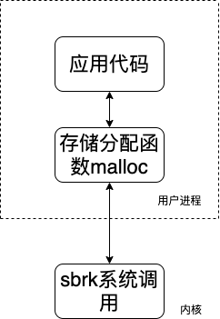
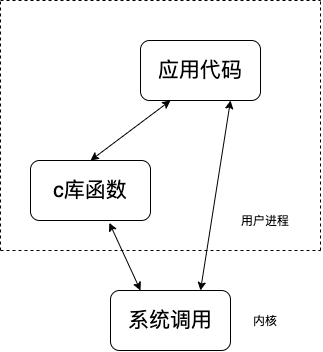
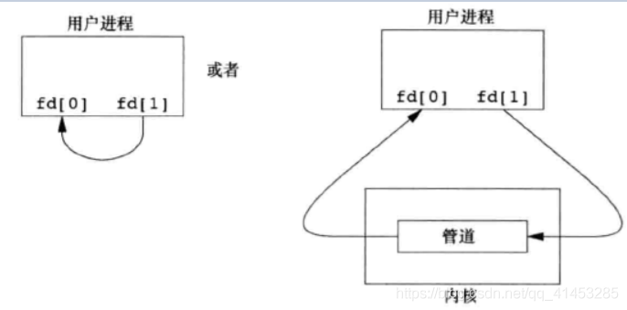
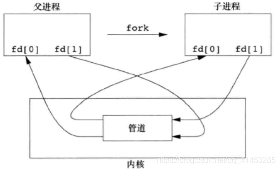
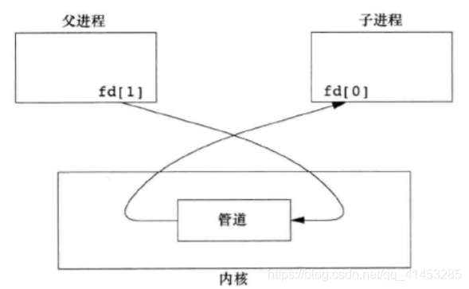

# UNIX高级环境编程
<center>Linux下一切皆文件</center>

- [UNIX高级环境编程](#unix高级环境编程)
  - [第一章 UNIX基础知识](#第一章-unix基础知识)
      - [1.UNIX体系结构](#1unix体系结构)
      - [2.登陆](#2登陆)
      - [3.shell](#3shell)
      - [4.文件和目录](#4文件和目录)
      - [5.输入与输出](#5输入与输出)
      - [6.程序和进程](#6程序和进程)
      - [7.出错处理(不怎么懂)](#7出错处理不怎么懂)
      - [8.用户标识](#8用户标识)
      - [9.信号](#9信号)
      - [10.时间值](#10时间值)
      - [11.系统调用和库函数](#11系统调用和库函数)
  - [第二章 UNIX标准及实现(此章先略过)](#第二章-unix标准及实现此章先略过)
      - [1.UNIX标准化](#1unix标准化)
      - [2.UNIX系统实现](#2unix系统实现)
      - [3.标准与实现的关系](#3标准与实现的关系)
  - [第三章 文件I/O](#第三章-文件io)
      - [1.文件描述符](#1文件描述符)
      - [2.函数open和openat](#2函数open和openat)
      - [3.creat函数](#3creat函数)
      - [4.close函数](#4close函数)
      - [5.lseek函数](#5lseek函数)
      - [6.函数read](#6函数read)
      - [7.函数write](#7函数write)
      - [8.I/O的效率](#8io的效率)
      - [9.文件共享](#9文件共享)
      - [10.原子操作](#10原子操作)
      - [11.函数dup与函数dup2](#11函数dup与函数dup2)
      - [12.函数sync、fsync、fdatasync](#12函数syncfsyncfdatasync)
      - [13.函数fcntl](#13函数fcntl)
  - [第十五章 进程间通信](#第十五章-进程间通信)
      - [1.管道](#1管道)
## 第一章 UNIX基础知识

#### 1.UNIX体系结构
```
内核：控制计算机硬件资源，提供程序运行环境。
系统调用：内核的接口统称为系统调用。
公用函数库：建立在系统调用接口之上。
shell：特殊的应用程序，为其他的应用程序提供了一个接口。
应用程序：操作系统包含了内核和一些其他软件，这些其他软件能使计算机发挥作用，并使计算机拥有自己的特性。
```

#### 2.登陆
```
口令文件：/etc/passwd 
nick:x:1000:1000:Nick,,,:/home/nick:/bin/bash 
登陆名：加密口令：数字用户ID：数字组ID：注释字段：起始目录：shell程序
```

#### 3.shell
```
Bourne shell    /bin/sh
Bourne-again shell      /bin/bash
C shell     /bin/csh
Korn shell      /bin/ksh
THENEX C shell  /bin/tcsh
```

#### 4.文件和目录
```
root   “/”
绝对路径和相对路径
```
```c
#include "apue.h"  // 自写头文件
#include <dirent>  // /usr/include/dirent.h

int main(int argc, char *argv[])
{
    DIR *dp;
    struct dirent *dirp;
    if (argc != 2) {
        err_quit("usage: is directory_name");
    }

    if ((dp = opendir(argv[1])) == NULL)
        err_sys("can't open %s", argv[1]);
    while ((dirp = readdir(dp)) != NULL)
        printf("%s\n", dirp->d_name);
    closedir(dp);
    exit(0);
}

```

#### 5.输入与输出
```
标准输入
标准输出
标准错误

不带缓冲的I/O:函数open、read、write、lseek以及close提供了不带缓冲的I/O
标准I/O:printf，getc，putc
标准I/O常量:stdin和stdout
文件描述符：简称fd，当应用程序请求内核打开/新建一个文件时，内核会返回一个文件描述符用于对应这个打开/新建的文件，其fd本质上就是一个非负整数，读写文件也是需要使用这个文件描述符来指定待读写的文件的
```

#### 6.程序和进程
```
程序:是一个存储在磁盘上某个目录中的可执行文件。
进程:执行的实例。
进程ID:唯一标识符。

进程控制的主要三个函数fork，exec，waitpid。
```
```c
#include <apue.h>
#include <sys/wait.h>

int main()
{
    char    buf[MAXLINE];
    pid_t   pid;
    int     status;

    printf("%% ");
    while (fgets(buf, MAXLINE, stdin) != NULL) {    /* 标准输入获取 */
        if (buf[strlen(buf) - 1] == '\n')
            buf[strlen(buf) - 1] = 0;
    

        if ((pid = fork()) < 0) {   
            err_sys("fork_error");
        } else if (pid == 0) {
            execlp(buf, buf, (char *)0);    /* 执行从标准输入读入的命令 */
            err_ret("could't execute : %s", buf);
            exit(127);
        }
        
        if ((pid = waitpid(pid, &status, 0)) < 0)
            err_sys("waitpid error");
            
        printf("%% ");

    }    
    exit(0);
}

```

#### 7.出错处理(不怎么懂)
```c
#include <apue.h>
#include <errno.h>

int main(int argc, char *argv[])
{
    fprintf(stderr, "EACCES: %s\n", strerror(EACCES));
    errno = ENOENT;
    perror(argv[0]);
    exit(0);
}

出错恢复:
```

#### 8.用户标识
```
用户ID:是一个数值。标识不同用户。(ID为0为root用户)
组ID:它是一个数值。用户可以划分到组内，这种机制允许同组之间的各个成员之间共享资源。
组文件:/etc/group
存储用户ID和组ID只需要四个字节
附属组ID:允许一个用户属于至多16组
```

#### 9.信号
```
进程有以下3种处理信号的方式：
1.忽略信号
2.终止该进程
3.提供一个函数，在信号发生时调用该函数。捕获该信号
```
```c
#include <apue.h>
#include <sys/wait.h>

static void sig_int(int);

int main()
{
    char    buf[MAXLINE];
    pid_t   pid;
    int     status;

    if (signal(SIGINT, sig_int) == SIG_ERR)
        err_sys("signal_err");

    printf("%% ");
    while (fgets(buf, MAXLINE, stdin) != NULL) {
        if (buf[strlen(buf) - 1] == '\n')
            buf[strlen(buf) - 1] = 0;
    

    if ((pid = fork()) < 0) {
        err_sys("fork_error");
    } else if (pid == 0) {
        execlp(buf, buf, (char *)0);
        err_ret("could't execute : %s", buf);
        exit(127);
    }
    
    if ((pid = waitpid(pid, &status, 0)) < 0)
        err_sys("waitpid error");
    printf("%% ");

    }    
    exit(0);
}

void sig_int(int signo)
{
    printf("interrupt\n%% ");
}

```

#### 10.时间值
```
日历时间:(开始时间为世界时间1970年1月1日00:00:00)用time_t保存时间值。
进程时间:(CPU时间)
通过time命令来查看
时钟时间；
用户CPU时间；
系统CPU时间；
```

#### 11.系统调用和库函数


malloc函数和sbrk函数调用


C库函数和系统调用之间的差别

## 第二章 UNIX标准及实现(此章先略过)

#### 1.UNIX标准化
```
ISO c标准
IEEE POSIX
single UNIX Specification
```

#### 2.UNIX系统实现
```
SVR4
4.4BSD
FreeBSD
Linux
Mac OS X
```
#### 3.标准与实现的关系
```

```

## 第三章 文件I/O

#### 1.文件描述符
```
对于内核而言，所有打开的文件都通过文字描述符引用。当读写一个文件时，使用open或者creat返回的文件描述标识符标识该文件。将其作为参数传递给read或write。
```

#### 2.函数open和openat
```c
#include <fcntl.h>

int open(const char *path, int oflag, ...);

int openat(int fd, const char *path, int oflag, ...);
```
```
fd参数把open和openat函数区分开来，有3种可能性
1.path参数表示的是绝对路径。在这种情况下，fd参数被忽略此时的openat函数相当于open函数
2.path参数指定的是相对路径名。fd参数指定了相对路径名在文件系统中的开始地址。fd参数是通过打开相对路径名所在的目录获取的。
3.path参数指定的是相对路径名。fd参数指定了相对路径名在文件系统中的开始地址。fd参数是通过打开相对路径名所在的目录获取的。

TOCTTOU错误
```

#### 3.creat函数
```c
#include <fcntl.h>

int creat(const char *path, mode_t mode);
1
// 此函数等效于open(path, O_WRONLY | O_CREAT | O_TRUNC, mode);
```
```
creat以只写方式打开创建的文件。
可以用open(path, O_RDWR | O_CREAT | O_TRUNC, mode);来实现读写方式打开。
```

#### 4.close函数
```c
#include <fcntl.h>

int close(int fd);
```

#### 5.lseek函数
> 涉及到了当前文件偏移量
```c
#include <unistd.h>

off_t lseek(int fd, off_t offset, int whence);
```
> 测试对其标准输入能否设置偏移量
```c
#include <apue.h>
 
int main()
{
    if (lseek(STDIN_FILENO, 0, SEEK_CUR) == -1)   
        printf("cannot seek\n");
    else
        printf("seek OK\n");
    exit(0);
}
```
> 检验lseek
```c
#include <apue.h>
#include <fcntl.h>

char buf1[] = "abcdefghij";
char buf2[] = "ABCDEFGHIJK";

int main(void) 
{
    int fd;

    if ((fd = creat("file.hole", FILE_MODE)) < 0)
        err_sys("creat error");
    if (write(fd, buf1, 10) != 10)
        err_sys("buf1 write error");
    if (lseek(fd, 16384, SEEK_SET) == -1)
        err_sys("lseek error");
    if (write(fd, buf2, 10) != 10)
        err_sys("buf2 write error");
    exit(0);
}
```

#### 6.函数read
```c
#include <unistd.h>

ssize_t read(int fd, void *buf, size_t nbytes);
```

#### 7.函数write
```c
#include <unistd.h>

ssize_t write(int fd, const void*buf, size_t nbytes);
```

#### 8.I/O的效率
> 缓冲区的长度影响了缓冲区的效率(到达4096之后，继续增加缓冲区长度对时间没有影响)

#### 9.文件共享 
```
1.每一个进程，在进程表中都有一个记录项。记录项包含一个一张打开的文件描述符表。
a.文件描述符标志
b.指向一个文件表项的指针。
2.内核为所有打开文件维持一张文件表。每个文件表项包含：
a.文件状态标志
b.当前文件偏移量
c.指向该文件V节点表项的指针。
3.每打开文件或者设备。都有一个v节点结构。
```

#### 10.原子操作
```c
if (lseek(fd, OL, 2) < 0)
    err_sys("lseek error");
if (write(fd, buf, 100) != 100)
    err_sys("write error");
```
> 多个进程同时使用这种方法将数据追加到同一文件，则会产生问题。
```c
#include <unistd.h>

ssize_t pread(int fd, void *buf, size_t nbytes, off_t offset);
ssize_t pwrite(int fd, const void *buf, size_t nbytes, off_t offset);
```
> 原子操作指的是多步组成的一个操作

#### 11.函数dup与函数dup2
```c
#include <unistd.h>

int dup(int fd);

int dup2(int fd, int fd2);
```
> dup2是一个原子操作，而close与fcntl包含两个函数。
> dup2和fcntl之间有不同的errno。

#### 12.函数sync、fsync、fdatasync
```c
#include <unistd.h>

int fsync(int fd);

int fdatasync(int fd);

void sync(void);
```
> 上面三个函数和缓冲区有关。详细看书。

#### 13.函数fcntl
> 改变已经打开的文件的属性。
```c
#include <unistd.h>

int fcntl(int fd, int cmd, ...);
```

## 第十五章 进程间通信

#### 1.管道
```
1. 历史上它们是半双工的。
2. 管道只能在具有公共祖先(父进程)的两个进程之间使用。
```
```c
#include <unistd.h>

int pipe(int fd[2]);
```
>fd返回两个文件描述符，fd[0]为读而打开，fd[1]为写而且打开。其中fd[1]的输出就是fd[0]的输入。
* 单进程使用
单进程的管道使用没有什么用处，不经常使用
下图是半双工管道。左图是简化的图解，有图告诉我们管道的数据其实要经过内核

* 程序先调用pipe函数，然后再fork，从而建立父进程到子进程之间的IPC通道

* 如果我们通过父进程向子进程发送数据，可以这样设置：父进 程关闭管道的读端（fd[0]），子进程则关闭写端（fd[1]）


```
1. 当读一个写端已经被关闭的管道时，在所有数据都被读取后，read返回0，表示文件结束。
2. 如果写（write）一个读端已被关闭的管道，则产生信号SIGPIPE。如果忽略该信号或者捕捉该信号并从其处理程序返回，则write返回-1，errno设置为EPIPE。
3. 在写管道（或FIFO）时，常量PIPE_BUF规定了内核中管道缓冲区的大小。如果对管道调用write，而且要求写的字节数小于等于PIPE_BUF，则此操作不会与其他进程对同一管道（或FIFO）的write操作穿插进行（当然，其他进程要求写的字节数也都小于等于PIPE_BUF）。但是，若有多个进程同时写一个管道（或FIFO），而且有进程（一个或几个）要求写的字节数超过PIPE_BUF字节数时，则写操作的数据可能相互穿插。用pathconf或fpathconf函数可以确定PIPE_BUF的值。
```

