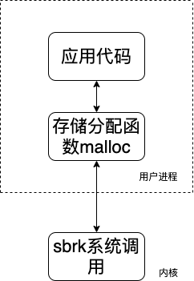
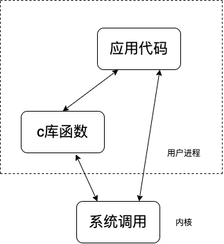

# UNIX高级环境编程
<center>Linux下一切皆文件</center>

- [UNIX高级环境编程](#unix高级环境编程)
  - [第一章 UNIX基础知识](#第一章-unix基础知识)
      - [1.UNIX体系结构](#1unix体系结构)
      - [2.登陆](#2登陆)
      - [3.shell](#3shell)
      - [4.文件和目录](#4文件和目录)
      - [5.输入与输出](#5输入与输出)
      - [6.程序和进程](#6程序和进程)
      - [7.出错处理(不怎么懂)](#7出错处理不怎么懂)
      - [8.用户标识](#8用户标识)
      - [9.信号](#9信号)
      - [10.时间值](#10时间值)
      - [11.系统调用和库函数](#11系统调用和库函数)
## 第一章 UNIX基础知识

#### 1.UNIX体系结构
```
内核：控制计算机硬件资源，提供程序运行环境。
系统调用：内核的接口统称为系统调用。
公用函数库：建立在系统调用接口之上。
shell：特殊的应用程序，为其他的应用程序提供了一个接口。
应用程序：操作系统包含了内核和一些其他软件，这些其他软件能使计算机发挥作用，并使计算机拥有自己的特性。
```

#### 2.登陆
```
口令文件：/etc/passwd 
nick:x:1000:1000:Nick,,,:/home/nick:/bin/bash 
登陆名：加密口令：数字用户ID：数字组ID：注释字段：起始目录：shell程序
```

#### 3.shell
```
Bourne shell    /bin/sh
Bourne-again shell      /bin/bash
C shell     /bin/csh
Korn shell      /bin/ksh
THENEX C shell  /bin/tcsh
```

#### 4.文件和目录
```
root   “/”
绝对路径和相对路径
```
```c
#include "apue.h"  // 自写头文件
#include <dirent>  // /usr/include/dirent.h

int main(int argc, char *argv[])
{
    DIR *dp;
    struct dirent *dirp;
    if (argc != 2) {
        err_quit("usage: is directory_name");
    }

    if ((dp = opendir(argv[1])) == NULL)
        err_sys("can't open %s", argv[1]);
    while ((dirp = readdir(dp)) != NULL)
        printf("%s\n", dirp->d_name);
    closedir(dp);
    exit(0);
}

```

#### 5.输入与输出
```
标准输入
标准输出
标准错误

不带缓冲的I/O:函数open、read、write、lseek以及close提供了不带缓冲的I/O
标准I/O:printf，getc，putc
标准I/O常量:stdin和stdout
文件描述符：简称fd，当应用程序请求内核打开/新建一个文件时，内核会返回一个文件描述符用于对应这个打开/新建的文件，其fd本质上就是一个非负整数，读写文件也是需要使用这个文件描述符来指定待读写的文件的
```

#### 6.程序和进程
```
程序:是一个存储在磁盘上某个目录中的可执行文件。
进程:执行的实例。
进程ID:唯一标识符。

进程控制的主要三个函数fork，exec，waitpid。
```
```c
#include <apue.h>
#include <sys/wait.h>

int main()
{
    char    buf[MAXLINE];
    pid_t   pid;
    int     status;

    printf("%% ");
    while (fgets(buf, MAXLINE, stdin) != NULL) {    /* 标准输入获取 */
        if (buf[strlen(buf) - 1] == '\n')
            buf[strlen(buf) - 1] = 0;
    

        if ((pid = fork()) < 0) {   
            err_sys("fork_error");
        } else if (pid == 0) {
            execlp(buf, buf, (char *)0);    /* 执行从标准输入读入的命令 */
            err_ret("could't execute : %s", buf);
            exit(127);
        }
        
        if ((pid = waitpid(pid, &status, 0)) < 0)
            err_sys("waitpid error");
            
        printf("%% ");

    }    
    exit(0);
}

```

#### 7.出错处理(不怎么懂)
```c
#include <apue.h>
#include <errno.h>

int main(int argc, char *argv[])
{
    fprintf(stderr, "EACCES: %s\n", strerror(EACCES));
    errno = ENOENT;
    perror(argv[0]);
    exit(0);
}

出错恢复:
```

#### 8.用户标识
```
用户ID:是一个数值。标识不同用户。(ID为0为root用户)
组ID:它是一个数值。用户可以划分到组内，这种机制允许同组之间的各个成员之间共享资源。
组文件:/etc/group
存储用户ID和组ID只需要四个字节
附属组ID:允许一个用户属于至多16组
```

#### 9.信号
```
进程有以下3种处理信号的方式：
1.忽略信号
2.终止该进程
3.提供一个函数，在信号发生时调用该函数。捕获该信号
```
```c
#include <apue.h>
#include <sys/wait.h>

static void sig_int(int);

int main()
{
    char    buf[MAXLINE];
    pid_t   pid;
    int     status;

    if (signal(SIGINT, sig_int) == SIG_ERR)
        err_sys("signal_err");

    printf("%% ");
    while (fgets(buf, MAXLINE, stdin) != NULL) {
        if (buf[strlen(buf) - 1] == '\n')
            buf[strlen(buf) - 1] = 0;
    

    if ((pid = fork()) < 0) {
        err_sys("fork_error");
    } else if (pid == 0) {
        execlp(buf, buf, (char *)0);
        err_ret("could't execute : %s", buf);
        exit(127);
    }
    
    if ((pid = waitpid(pid, &status, 0)) < 0)
        err_sys("waitpid error");
    printf("%% ");

    }    
    exit(0);
}

void sig_int(int signo)
{
    printf("interrupt\n%% ");
}

```

#### 10.时间值
```
日历时间:(开始时间为世界时间1970年1月1日00:00:00)用time_t保存时间值。
进程时间:(CPU时间)
通过time命令来查看
时钟时间；
用户CPU时间；
系统CPU时间；
```

#### 11.系统调用和库函数


malloc函数和sbrk函数调用


C库函数和系统调用之间的差别


