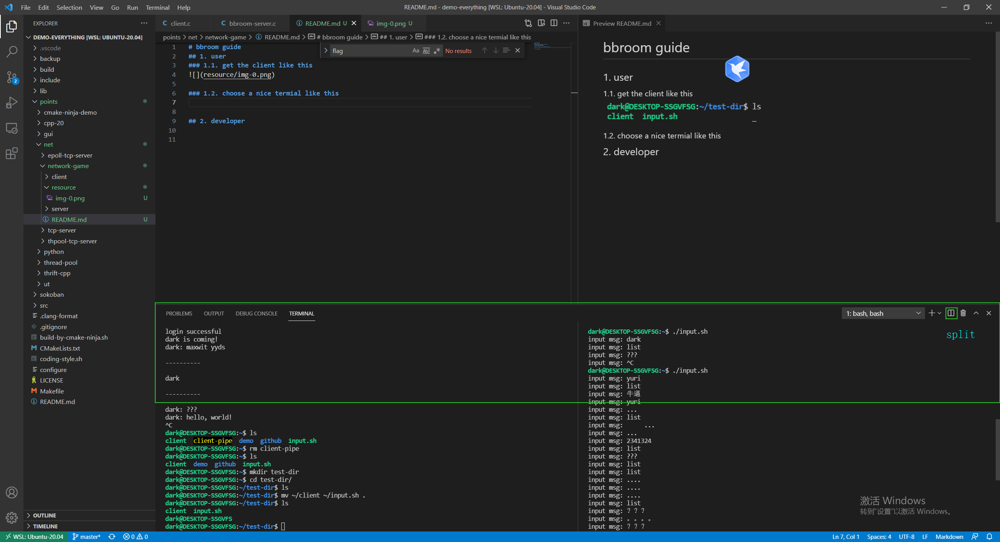
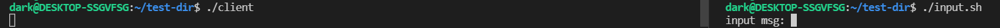
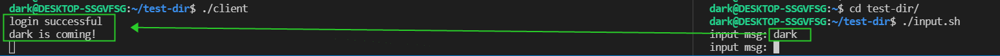
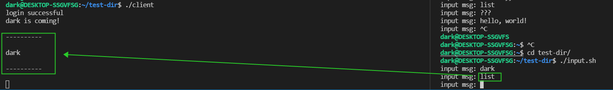
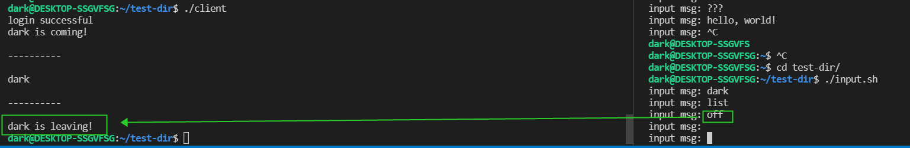

# bbroom guide

## 1. user
### 1.1. get the client like this

### 1.2. choose a nice termial like this

### 1.3. run
you gonna run the 'client' first in the left window, then run the 'input.sh' in the right.

### 1.4. how to login?

### 1.5. how do I find out who is online?

### 1.6. if want to leave?

### 1.7. finally
You can easily understand that the left window runs as a client on the display side and the right window runs as an input side. So, have fun with the bbroom!

## 2. developer

